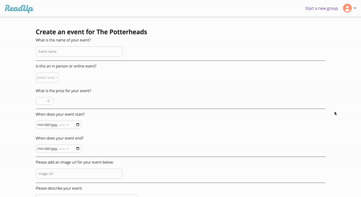

<a name="readme-top"></a>

<!-- PROJECT LOGO -->
<br />
<div align="center">
  <a href="https://github.com/claudiakosylak/api-project-meetup.git">
    
  </a>

<h3 align="center">ReadUp</h3>

  <p align="center">
    ReadUp is a platform for users to meet up with others with similar reading interests. 
    <br />
    <a href="https://github.com/claudiakosylak/api-project-meetup"><strong>Explore the docs »</strong></a>
    <br />
    <br />
    <a href="https://meetup-api-project-pyx7.onrender.com">View Live Site</a>
    ·
    <a href="https://github.com/claudiakosylak/api-project-meetup/issues">Report Bug</a>
    ·
    <a href="https://github.com/claudiakosylak/api-project-meetup/issues">Request Feature</a>
  </p>
</div>


<!-- TABLE OF CONTENTS -->
<details>
  <summary>Table of Contents</summary>
  <ol>
    <li>
      <a href="#about-the-project">About The Project</a>
      <ul>
        <li><a href="#built-with">Built With</a></li>
      </ul>
    </li>
    <li>
      <a href="#getting-started">Getting Started</a>
      <ul>
        <li><a href="#installation">Installation</a></li>
      </ul>
    </li>
    <li><a href="#usage">Usage</a></li>
    <li><a href="#roadmap">Roadmap</a></li>
    <li><a href="#contact">Contact</a></li>
  </ol>
</details>


<!-- ABOUT THE PROJECT -->
## About The Project

<div align="center">

</div>


[Live site available here](https://meetup-api-project-pyx7.onrender.com)

This project, called ReadMe, is a loose clone of the Meetup site. Users can meetup with other users who are fans of similar book series or have similar reading interests. 

Highlights of features: 
* Users can create or join a group pertaining to their reading interests
* Users can update and delete groups they own
* Users can create or delete events for groups they own
* Users can join or leave groups they are a member of
* Users can RSVP to attend or cancel their RSVP for events in groups they are a part of
* Users can view all of the groups and events they are currently a part of or attending
* Users can browse all public groups and events on the platform 

<p align="right">(<a href="#readme-top">back to top</a>)</p>


### Built With

* 
* 
* 
* 
* 
* 

<p align="right">(<a href="#readme-top">back to top</a>)</p>


<!-- GETTING STARTED -->
## Getting Started

Follow these instructions to get started:

### Installation

1. Clone the repo
   ```sh
   git clone https://github.com/claudiakosylak/api-project-meetup.git
   ```
2. Install NPM packages in both frontend and backend folders
   ```sh
   npm install
   ```
3. Start the server in both the frontend and the backend folders
   ```sh
   npm start
   ```

<p align="right">(<a href="#readme-top">back to top</a>)</p>


<!-- USAGE EXAMPLES -->
## Usage

### Landing Page

When one lands on the site, users are invited to either join the site or to log in. Upon clicking Log In, users can also log in as a demo user. 

<div align="center">

</div>

### View Groups and Events

Users can browse all groups and events available on the site. When users are logged in, they can access the groups and events they are a part of through the profile menu in the upper right corner. 

<div align="center">

</div>

### Create a Group

Users can create a group by clicking "Start a new group" to the left of their profile icon on the top right. 

<div align="center">

</div>

### Manage Your Group

As an owner of a group, users have the option to create an event for the group, update the group, or delete the group on the group's details page. Any user can view the general details of public groups as well as the past and upcoming events on this page. 

<div align="center">

</div>

### Create an Event

Users can create events for groups that they own. They can access this form on their group's details page. 

<div align="center">

</div>

### Join or Leave a Group

Users can join a group they are not yet a part of on the group's details page. Users can then choose to leave groups they are a part of on the same page. 

<div align="center">

</div>

### RSVP for an Event or Cancel RSVP

Users can RSVP to events for groups they are a part of on that event's details page. If they are currently RSVP'd and do not wish to attend anymore, they can cancel their attendance. All users can view details for public events on this page. 

<div align="center">

</div>

<p align="right">(<a href="#readme-top">back to top</a>)</p>

<!-- ROADMAP -->
## Roadmap

- [ ] Add Update Event Feature
- [ ] Link groups and events to venues
- [ ] AWS S3 Buckets to more easily upload pictures 

See the [open issues](https://github.com/othneildrew/Best-README-Template/issues) for a full list of proposed features (and known issues).

<p align="right">(<a href="#readme-top">back to top</a>)</p>

<!-- CONTACT -->
## Contact

Claudia Kosylak - https://www.linkedin.com/in/claudiakosylak/ - claudiakosylak@gmail.com

Project Link: [https://github.com/claudiakosylak/api-project-meetup.git](https://github.com/claudiakosylak/api-project-meetup.git)

<p align="right">(<a href="#readme-top">back to top</a>)</p>
